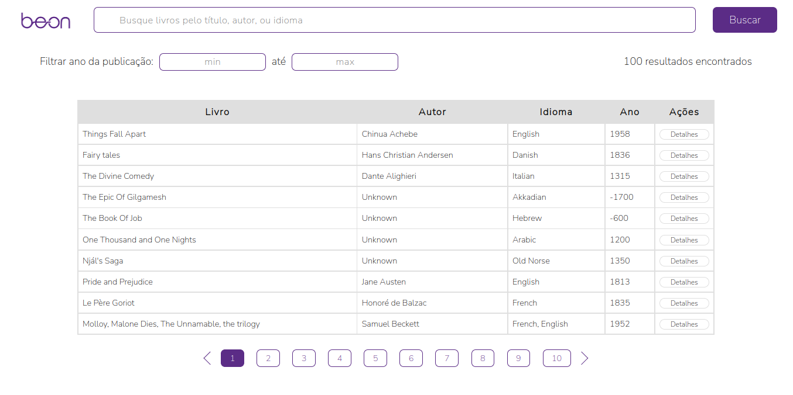

# BEON - Teste para a posição de Desenvolvedor Frontend ReactJS

Esta é a minha solução para o problema proposto pelo [BEON](https://beon.com.br/). O BEON produz experiências de compra melhores para os seus clientes, e resultados de vendas melhores para você e para o seu e-commerce.

## Conteúdo

- [Visão Geral](#visão-geral)
  - [O Desafio](#o-desafio)
  - [Screenshot](#screenshot)
  - [Tecnologias](#tecnologias)
- [Instruções de Uso](#instruções-de-uso)
- [Autor](#autor)

## Visão Geral

### O Desafio

Neste desafio foi criada uma interface para busca de livros, alimentada por um [JSON Server](https://github.com/typicode/json-server).

É esperada as seguintes funcionalidades:
- Buscar livros pelo título, autor ou idioma;
- Listar livros (título, autor, idioma, ano);
- Apresentar quantidades de registros encontrados;
- Paginar o resultado da busca de 10 em 10 itens;
- Filtrar livros pelo período (ano);
- Visualizar detalhes do livro (apresentar todos os atributos);

### Screenshot

### Tecnologias

- [ReactJS](https://reactjs.org/)
- CSS
- Context

## Instruções de Uso

### 1 - Servidor

Para rodar a aplicação corretamente, primeiro é necessário acessar nosso servidor [aqui](https://github.com/beonica/jsonserver) e seguir as orientações especificadas lá para o funcionamento correto da API.

### 2 - Frontend

Com nosso servidor rodando, podemos agora configurar nosso frontend:
 - Clone este repositório:
    - `git clone git@github.com:palucas94/beon-book-search-challenge.git`

 - Acesse a raíz da aplicação:
    - `cd beon-book-search-challenge`
    
  - Instale as dependências do projeto:
    - `npm install`

  - Inicie a aplicação:
    - `npm start`

  - E pronto! A aplicação frontend rodará em [localhost:/3000](http://localhost:3000/) e o servidor em [http://localhost:4000/books](http://localhost:4000/books). Boa procura! :wink:

## Autor

- LinkedIn - [Lucas Pontes Arruda](https://www.linkedin.com/in/lucas-pontes-arruda/)
- [Portfolio](https://palucas.vercel.app/)
